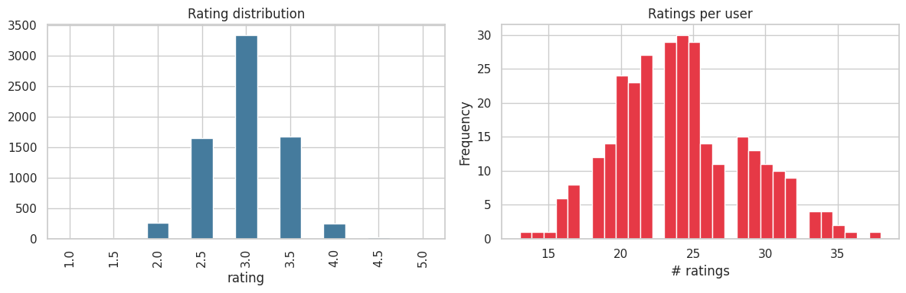
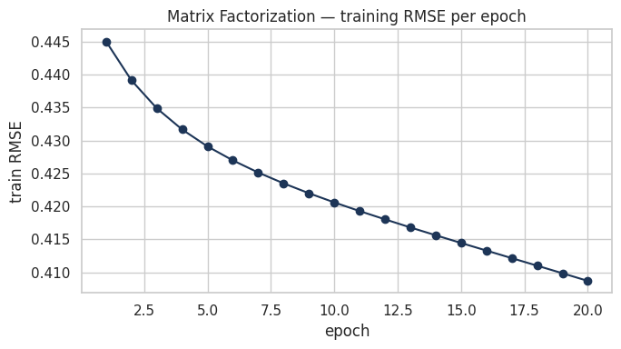

# RECOMMENDATION-SYSTEM

*COMPANY*: CODTECH IT SOLUTIONS

*NAME*: VAIBHAV SINGH

*INTERN ID*: CTIS9834

*DOMAIN*: MACHINE LEARNING

*DURATION*: 8 WEEKS

*MENTOR*: NEELA SANTOSH

## Description

This project implements a **recommendation system** using **matrix factorization** and **collaborative filtering** techniques. The deliverable is a Jupyter Notebook that showcases recommendation results together with evaluation metrics.

The notebook uses the **MovieLens 100K** dataset—100,000 ratings from 943 users on 1,682 movies—and builds two complementary recommenders: a **Matrix Factorization** model (learned from scratch with stochastic gradient descent) and an **item-based Collaborative Filtering** model (cosine similarity). It then compares them and produces Top-N movie recommendations for a user. If the dataset can't be downloaded, the notebook falls back to a synthetic ratings dataset with latent structure so it always runs end-to-end.

Matrix Factorization learns compact latent "taste" vectors for each user and item, while item-based Collaborative Filtering recommends items similar to those a user already liked—two of the foundational approaches in modern recommender systems.

## Features

* **Matrix Factorization from scratch**: latent user/item factors + bias terms + L2 regularization, trained with SGD
* **Item-based Collaborative Filtering** using cosine similarity
* **Rating Metrics**: RMSE and MAE on a held-out test set
* **Ranking Metrics**: Precision@K and Recall@K
* **Top-N Recommendations** generated for a sample user
* **Robust Loading**: auto-downloads MovieLens 100K, with a synthetic fallback

## Requirements

* Python 3.7+
* scikit-learn, pandas, NumPy, Matplotlib, Seaborn
* Jupyter Notebook — or run it directly in **Google Colab** with no local setup

## Setup & Run Instructions

Clone this repository:

```bash
git clone https://github.com/Student-of-coding/recommendation-system.git
cd recommendation-system
```

Install the dependencies and launch the notebook:

```bash
pip install -r requirements.txt
jupyter notebook recommendation_system.ipynb
```

Or open `recommendation_system.ipynb` in **Google Colab** and choose *Runtime → Run all* (it uses the real MovieLens 100K dataset automatically).

## Usage

1. Open `recommendation_system.ipynb`.
2. Run all cells from top to bottom (the dataset downloads automatically).
3. Review the RMSE/MAE comparison, Precision@K / Recall@K, and the Top-N recommendation list.
4. Change the sample user index to generate recommendations for a different user.

## Code Overview

* **Data Loading (`load_movielens_100k`)** — downloads MovieLens 100K, or builds a synthetic latent-structure dataset if the download fails.
* **Exploration** — reports sparsity and plots the rating distribution and ratings-per-user.
* **Indexing & Split** — maps raw user/item IDs to contiguous indices and makes an 80/20 train/test split.
* **Matrix Factorization (`MatrixFactorization`)** — a from-scratch class that learns latent factors and biases with SGD and tracks RMSE per epoch.
* **Item-based Collaborative Filtering** — builds the user-item matrix, computes item-item cosine similarity, and predicts via a similarity-weighted average.
* **Evaluation** — RMSE/MAE for both models plus `precision_recall_at_k`.
* **Recommendations (`recommend_for_user`)** — scores all unseen items and returns the Top-N.

## Limitations & Future Work

* Explicit-rating focus—real systems also use implicit feedback (clicks, watch time).
* Cold-start (new users/items) isn't handled; content features would help (hybrid recommender).
* For production scale, use optimized libraries such as `surprise` (SVD) or `implicit` (ALS).

## OUTPUT



Exploratory view of the data: the distribution of rating values and the number of ratings per user, highlighting the sparsity typical of recommendation datasets.


Training RMSE decreasing across epochs as the Matrix Factorization model learns the latent user and item factors.



Side-by-side RMSE and MAE for Matrix Factorization vs. item-based Collaborative Filtering (lower is better).

---

📌 **Recommendation System** demonstrates two core recommender approaches—matrix factorization and collaborative filtering—complete with rating and ranking evaluation metrics and Top-N recommendations. Extend it with hybrid features or an optimized library for scale!
